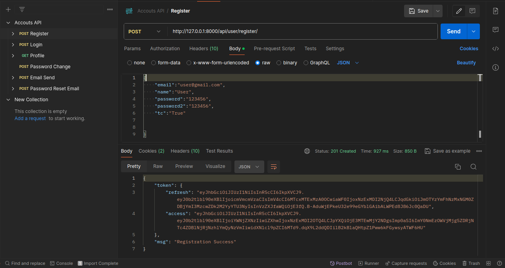
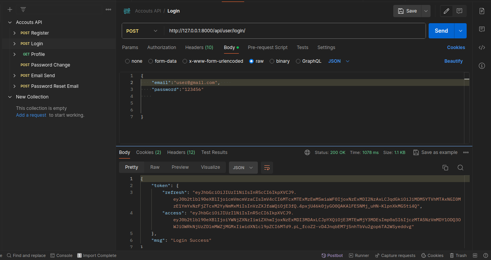
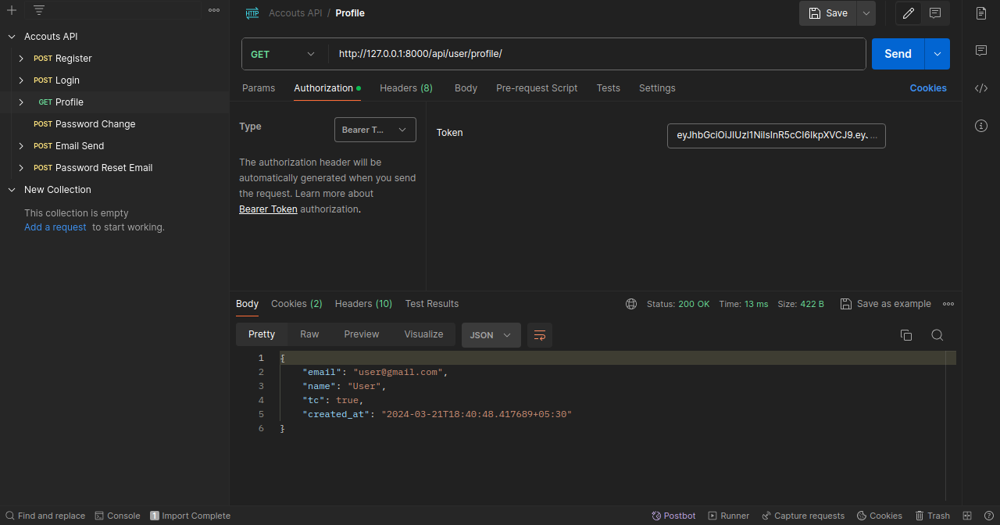

# Account API

Account API is a Django-based RESTful API endpoint for user authentication and related functionalities. It utilizes JSON Web Tokens (JWT) for user authentication, offering secure token-based authentication.

## Installation

1. Clone the repository:
   ```bash
   git clone https://github.com/Yyuichiii/AccountAPI.git
   ```

2. Navigate to the project directory:
   ```bash
   cd AccountAPI
   ```

3. Install dependencies using pip:
   ```bash
   pip install -r requirements.txt
   ```

## Usage

1. Run Django migrations to set up the database:
   ```bash
   python manage.py migrate
   ```

2. Start the Django development server:
   ```bash
   python manage.py runserver
   ```
3. Obtain an access token by sending a POST request to the /login/ endpoint with valid credentials. The response will include      an access token.

## API Endpoints

- **Register User**: `POST` `account/register/` 
- **Login User**: `POST` `account/login/`
- **User Profile**: `GET` `account/profile/`
- **Change Password**: `POST` `account/password/`

## Screenshots





## Documentation

For detailed usage instructions and examples, refer to the documentation provided in the repository.

## Contributing

Contributions are welcome! Please open an issue or submit a pull request with any enhancements or bug fixes.

## License

This project is licensed under the MIT License - see the [LICENSE](LICENSE) file for details.
